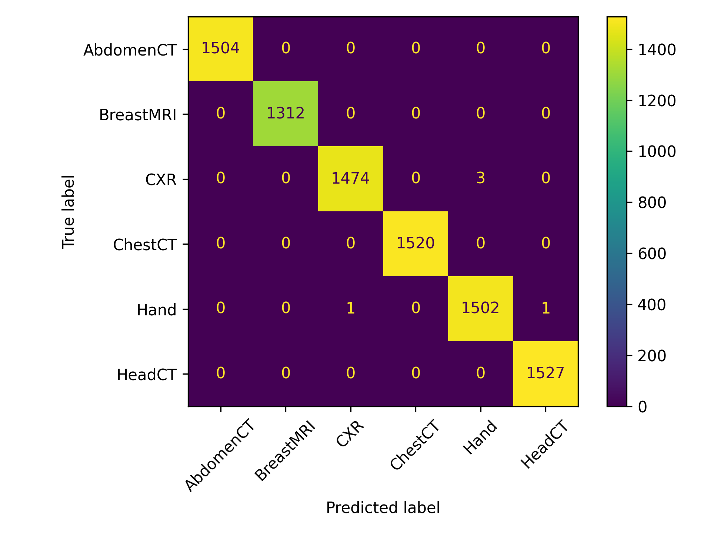

# MONAI MedNIST Baseline

**Medical image classification baseline using MONAI and PyTorch**

A complete, reproducible medical image classification pipeline on the MedNIST dataset.
Built as a foundation project for developing practical skills in medical imaging AI —
with a particular emphasis on clean code structure, preprocessing with MONAI transforms,
and evaluation that goes beyond accuracy.

---

## Results

Trained a custom CNN on 58,954 images across 6 medical imaging classes.
Evaluated on a held-out test set of **8,844 images**.

| Metric | Value |
|---|---|
| Test accuracy | **99.94%** |
| Macro F1-score | **0.9994** |
| Macro precision | **0.9994** |
| Macro recall | **0.9994** |
| Total misclassifications | **5 out of 8,844** |

### Per-class results

| Class | Precision | Recall | F1-score | Test samples |
|---|---|---|---|---|
| AbdomenCT | 1.0000 | 1.0000 | 1.0000 | 1,504 |
| BreastMRI | 1.0000 | 1.0000 | 1.0000 | 1,312 |
| ChestCT | 1.0000 | 1.0000 | 1.0000 | 1,520 |
| CXR | 0.9993 | 0.9980 | 0.9986 | 1,477 |
| Hand | 0.9980 | 0.9987 | 0.9983 | 1,504 |
| HeadCT | 0.9993 | 1.0000 | 0.9997 | 1,527 |

### Confusion matrix



The off-diagonal entries show only 5 total misclassifications across the full test set —
3 CXR images predicted as Hand, 1 Hand predicted as CXR, and 1 Hand predicted as HeadCT.
All other classes were classified perfectly.

### Training history

| Epoch | Train loss | Train accuracy | Val loss | Val accuracy |
|---|---|---|---|---|
| 1 | 0.0946 | 96.92% | 0.0088 | 99.75% |
| 2 | 0.0120 | 99.62% | 0.0093 | 99.76% |
| 3 | 0.0074 | 99.76% | 0.0057 | 99.84% |
| 4 | 0.0058 | 99.83% | 0.0051 | 99.81% |
| 5 | 0.0065 | 99.80% | 0.0057 | **99.86%** |

The model converged quickly — reaching 99.75% validation accuracy after a single epoch —
and continued improving steadily. Best checkpoint saved at epoch 5.

---

## Dataset visual check

Before training, a sample batch was visualised to verify that images, labels, and
preprocessing were working correctly. This step matters in medical imaging: model results
are only meaningful when the input data and label mapping have been verified first.


---

## Dataset

**MedNIST** is a small medical imaging dataset used for MONAI tutorials and baseline
classification experiments. It contains six classes of 2D medical images.

| Class | Images | Modality |
|---|---|---|
| AbdomenCT | 10,000 | CT |
| BreastMRI | 8,954 | MRI |
| ChestCT | 10,000 | CT |
| CXR | 10,000 | X-ray |
| Hand | 10,000 | X-ray |
| HeadCT | 10,000 | CT |

**Total verified images:** 58,954

---

## Project structure

```text
monai-mednist-baseline/
├── src/
│   ├── config.py          # Paths, hyperparameters, device selection
│   ├── data.py            # MedNISTDataset class, MONAI transforms, dataloaders
│   ├── model.py           # Custom CNN architecture
│   ├── train.py           # Training loop with checkpointing
│   ├── evaluate.py        # Test-set evaluation, classification report, confusion matrix
│   ├── utils.py           # Reproducibility (seed setting)
│   ├── visualize_data.py  # Sample batch visualisation
│   └── load_mednist.py    # Dataset download via MONAI
├── results/
│   ├── figures/
│   │   ├── confusion_matrix.png
│   │   └── sample_mednist_images.png
│   └── metrics/
│       ├── classification_report.json
│       └── training_history.json
├── requirements.txt
└── README.md
```

---

## Model architecture

A custom CNN built in PyTorch:

- **Input:** `[batch_size, 1, 64, 64]` (greyscale medical image)
- **Feature extractor:** 3 × (Conv2d → ReLU → MaxPool2d), channels 1→16→32→64
- **Classifier:** Flatten → Linear(4096, 128) → ReLU → Dropout(0.3) → Linear(128, 6)
- **Output:** `[batch_size, 6]` (class logits)

```python
MedNISTCNN(
  features: Conv2d(1→16) → ReLU → MaxPool2d
            Conv2d(16→32) → ReLU → MaxPool2d
            Conv2d(32→64) → ReLU → MaxPool2d
  classifier: Flatten → Linear(4096,128) → ReLU → Dropout(0.3) → Linear(128,6)
)
```

---

## Pipeline overview

| Step | Script | What it does |
|---|---|---|
| Download data | `load_mednist.py` | Downloads MedNIST via MONAI |
| Visualise | `visualize_data.py` | Saves sample batch with labels |
| Train | `train.py` | Trains CNN, saves best checkpoint |
| Evaluate | `evaluate.py` | Runs on test set, saves report + confusion matrix |

---

## Preprocessing

MONAI transforms applied to each image before training:

```python
Compose([
    LoadImage(image_only=True),   # Load image from path
    EnsureChannelFirst(),          # Add channel dim: (H,W) -> (1,H,W)
    ScaleIntensity(),              # Normalise pixel values to [0,1]
    Resize((64, 64)),              # Standardise spatial dimensions
    ToTensor(),                    # Convert to PyTorch tensor
])
```

---

## Training configuration

| Parameter | Value |
|---|---|
| Epochs | 5 |
| Batch size | 64 |
| Optimiser | Adam |
| Learning rate | 0.001 |
| Loss function | CrossEntropyLoss |
| Train / val / test split | 70% / 15% / 15% |
| Random seed | 42 |
| Device | Auto (MPS / CUDA / CPU) |

---

## How to run

```bash
# Clone and install
git clone https://github.com/Namitha-Narayanan-AI/monai-mednist-baseline.git
cd monai-mednist-baseline
pip install -r requirements.txt

# Download dataset
python src/load_mednist.py

# Visualise a sample batch
python src/visualize_data.py

# Train
python src/train.py

# Evaluate on test set
python src/evaluate.py
```

---

## Requirements

```
torch
monai
scikit-learn
matplotlib
tqdm
numpy
```

---

## Limitations and context

MedNIST is a relatively easy classification task — the six classes are visually very
distinct, which explains the near-perfect results. This project is not a clinical
diagnostic model and the results should not be interpreted as such.

The value of this project is in the pipeline itself: reproducible data loading,
proper train/val/test splitting, MONAI-based preprocessing, structured experiment
tracking, and evaluation that reports per-class metrics rather than just aggregate accuracy.

This work directly informs the next stage of my portfolio: extending these workflows toward
harder, clinically-grounded tasks — beginning with CBIS-DDSM mammography classification
and radiomics feature extraction in the
[oncology-imaging-concept-detection](https://github.com/Namitha-Narayanan-AI/oncology-imaging-concept-detection)
workspace.

---

