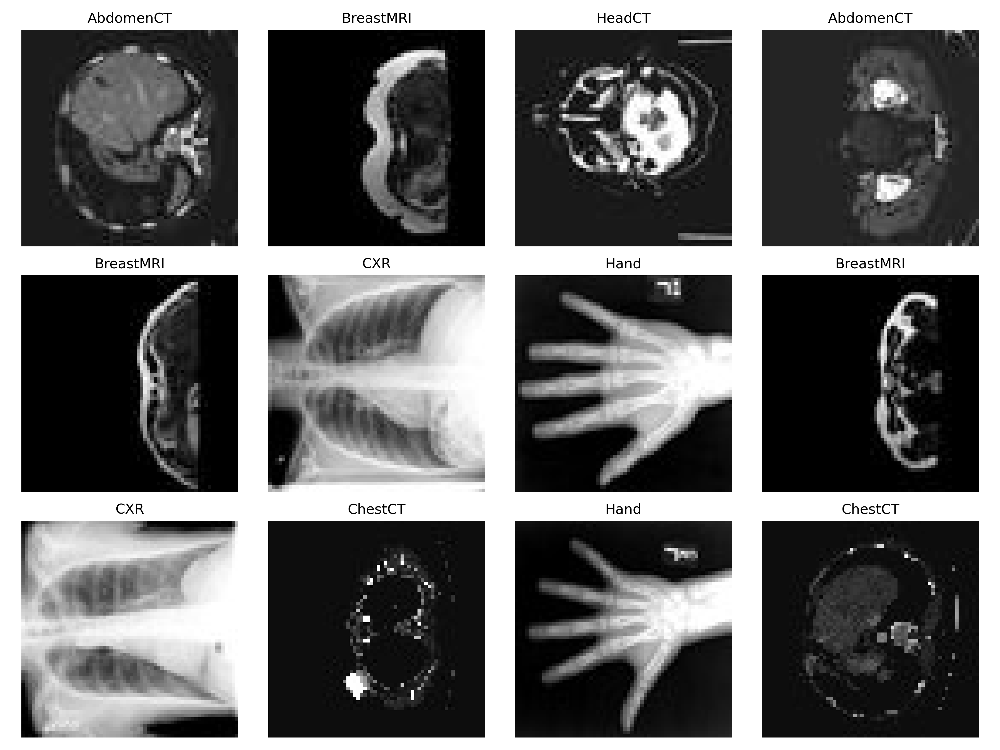

# MONAI MedNIST Baseline

**Medical image classification baseline using MONAI and PyTorch**

This project implements a clean, reproducible medical image classification workflow on the MedNIST dataset. It was built as a foundation project for developing practical skills in medical imaging AI before extending toward oncology imaging, concept detection, explainable AI, radiomics, and radiogenomics research.

---

## Project Snapshot

| Component | Details |
|---|---|
| Task | Medical image classification |
| Dataset | MedNIST |
| Frameworks | MONAI, PyTorch |
| Model | Custom CNN |
| Classes | AbdomenCT, BreastMRI, ChestCT, CXR, Hand, HeadCT |
| Input shape | `[batch_size, 1, 64, 64]` |
| Evaluation | Accuracy, precision, recall, F1-score, confusion matrix |
| Best validation accuracy | `0.9986` |
| Test set size | `8,844 images` |

---

## Visual Dataset Check

Before training, I visualized a sample batch to verify that the images, labels, and preprocessing pipeline were working correctly.



This step is important in medical imaging projects because model results are meaningful only when the input data and label mapping are verified first.

---

## Project Overview

The aim of this project is to implement a complete baseline workflow for medical image classification.

The pipeline includes:

- Dataset download and verification
- Medical image preprocessing using MONAI transforms
- Visual inspection of image-label pairs
- CNN model implementation
- Model training and checkpointing
- Test-set benchmarking
- Classification report generation
- Confusion matrix visualization

This is a baseline learning project, not a clinical diagnostic model.

---

## Dataset

This project uses the **MedNIST** dataset, a small medical imaging dataset commonly used for MONAI tutorials and baseline classification experiments.

The dataset contains six classes:

| Class | Number of Images |
|---|---:|
| AbdomenCT | 10,000 |
| BreastMRI | 8,954 |
| ChestCT | 10,000 |
| CXR | 10,000 |
| Hand | 10,000 |
| HeadCT | 10,000 |

**Total verified images:** `58,954`

Expected dataset structure:

```text
data/MedNIST/
├── AbdomenCT/
├── BreastMRI/
├── ChestCT/
├── CXR/
├── Hand/
└── HeadCT/